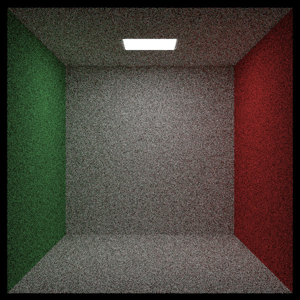

# Ray Tracing in One Weekend libros 1 & 2
Implementacion propia de los dos primeros libros sobre raytracing de Peter Shirley. Los libros se encuentran en: https://github.com/RayTracing/raytracing.github.io

# Diferencias con el libro
* Ejecución en múltiples hilos (tantos como sea posible)
* Ejecución distribuida con Open MPI
* Codeado en español
* Documentación sobre las matemáticas más heavies

# Cómo ejecutar en forma normal
```
make normal
./rtiow_normal.bin
```

# Cómo ejecutar con Open MPI
Primero es necesario tener configurado una topología con Open MPI instalado en cada nodo y modificar el archivo host_file de acuerdo a esta. Cada nodo debe ser accesible con ssh desde el nodo donde se ejecutará el programa. 

Para más información sobre cómo instalar y configurar Open MPI sobre una red LAN:
* https://www.open-mpi.org/faq/?category=building  
* https://mpitutorial.com/tutorials/running-an-mpi-cluster-within-a-lan/
* https://mpitutorial.com/tutorials/mpi-hello-world/

Para compilar y ejecutar:
```
make distribuido
mpirun -np 3 -hostfile host_file ./rtiow_distribuido.bin
```
Nota: la opción -np indica el número de workers que usará MPI para distribuir la ejecución del programa.
# Capturas del proceso





