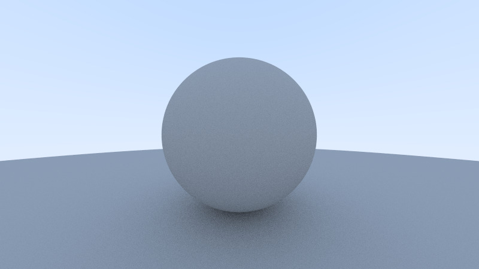
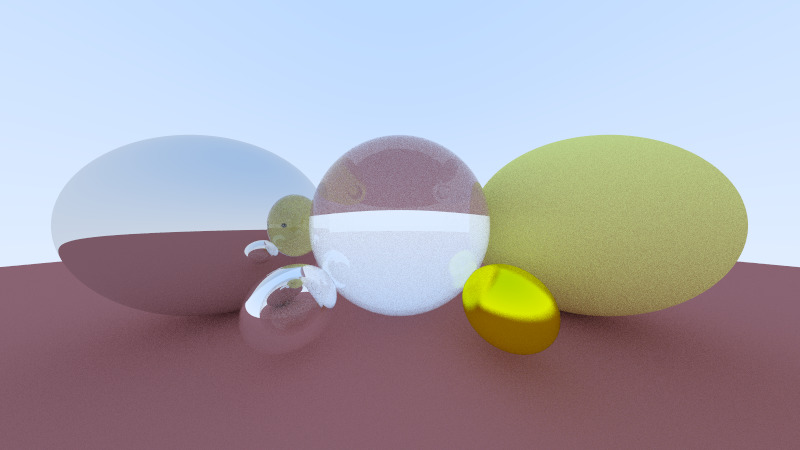
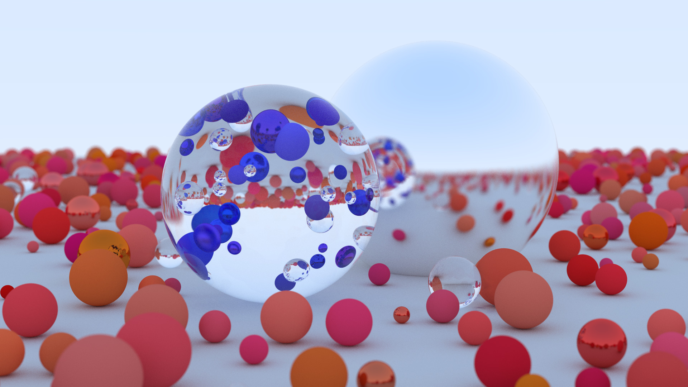
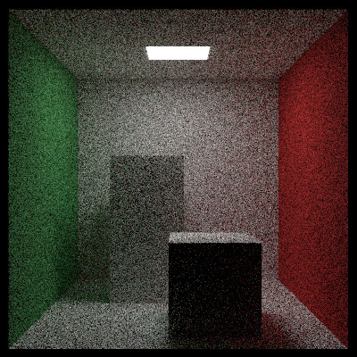

# Ray Tracing in One Weekend libros 1 & 2

# Cómo ejecutar
`gcc main.cpp -o Debug2/rtiow.bin -I. -std=c++14 -lm -lstdc++ --pedantic-errors -O3 -lpthread && cd Debug2 && ./rtiow.bin && cd ..`

# Capturas del proceso

